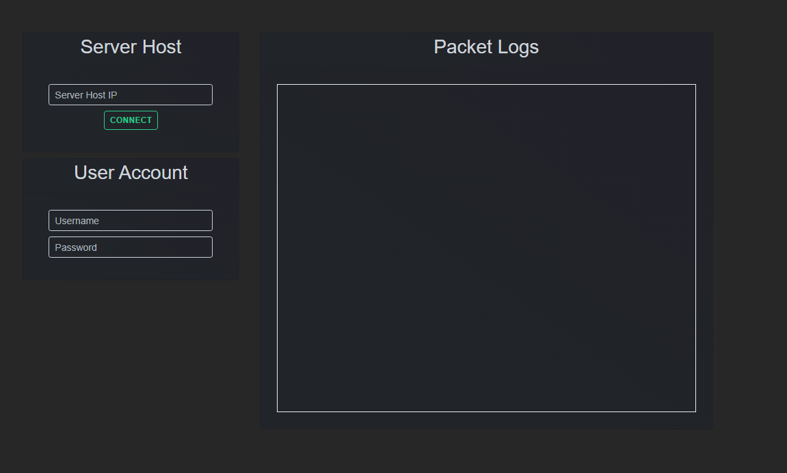
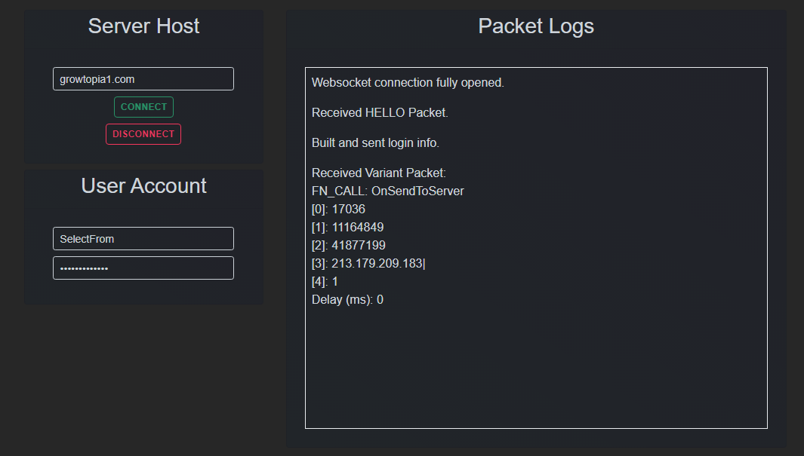
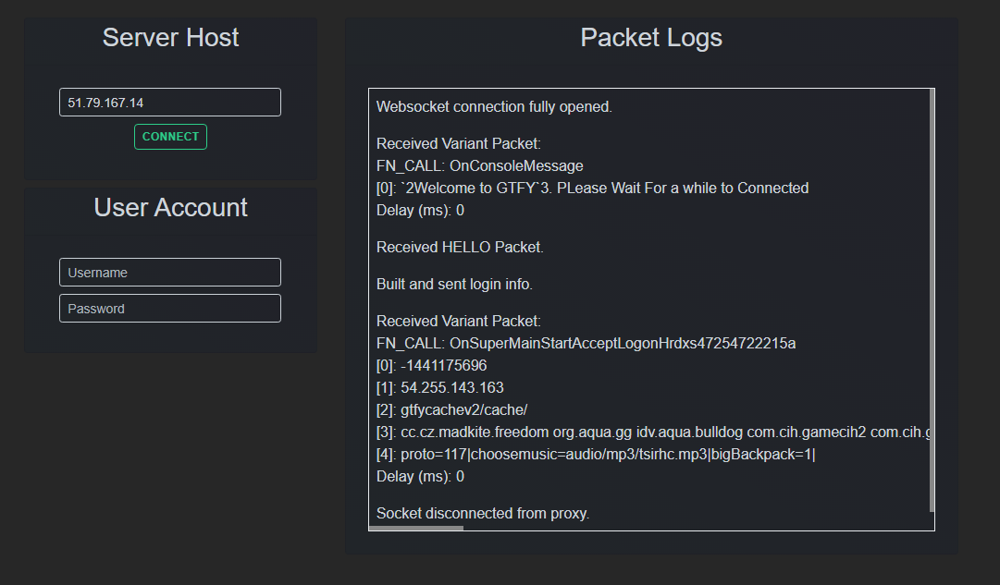

# GTBot
 A Web-based Growtopia Bot.

## Previews




## How it works
Basically, a NodeJS app is created, which acts as a ENet Client and also a Websocket server. It's a proxy to make communication from the website to ENet.  
It uses websockets to communicate to make it easier, and since js on web only supports tcp.

## Setup
Services used:
  - Proxy (/proxy)
  - Website (Optional, you can just connect via websockets instead of websites)
  - Cors (Required if website is used.)

Make sure you have the necessary tools installed, which are:
- For Windows:  
  - Windows Build Tools (`npm install --global windows-build-tools`)

- For Linux:
  - Build Tools (Install `build-essential`)

- Both:
  - Node GYP (`npm install --global node-gyp`)  
  - Python 2.7

Once all the necessary tools are installed, you can now install the packages by doing:
```
$ npm install
```  

Once the packages are installed, you should configure the config inside the `config.json` file.  
The `config` file contains the required data to make it work.  

`nodes` - The nodes array is what the proxy code will create and the nodes to connect to from the website. When starting up the proxy, it will create `X` amount of forks of the master process with each fork containing a different node instance. Then the website will also choose from those nodes on which to connect to **randomly**.
  - Each element in the `nodes` array contains an object, with two fields. `ip` and `port`. The `ip` is what the website will use to connect through, and the `port` field will be the port the proxy will listen to and the port the website will connect through.

`cors` - Next up is the `cors` object. This is pretty much a proxy for web requests to "bypass" the no-cross origin errors. This should only be set if you are using the website. It has 2 properties, `host` and `port`.
  - `host` would be the ip on which the cors proxy is hosted at.
  - The `port` determines on what port the cors proxy is listening to.

## Making it online
### Proxy
  To turn on the proxy, you must build the necessary native module first. By simply doing:  
  ```
  $ npm run buildProxy
  ```
  After that, just run the proxy by doing `npm run proxy`.

### Website
  The website uses Nextjs which is a framework over React. It makes server side rendering and routes much easier to handle. To run it there are two options, `dev` mode and `production` mode.  

  `dev` mode is for development purposes only. If you want to edit the site and see a live preview, `dev` mode would be the best for you. Otherwise, use `production` mode to use a fast version of the site that is production-ready.

  To run the `dev` mode version of the site, do:
  ```
  $ npm run siteDev
  ```
  
  While for the production mode, you would have to do these two simultaneously.
  ```
  $ npm run buildSite
  $ npm run site
  ```

  Both modes listens to port `:80` for the website.

### Cors
  The cors proxy is pretty much easy to run, you simply do:
  ```
  $ npm run cors
  ```
  and it should be online.

## TODO List:
  - [x] Restructure config & redesign website.
  - [x] Recode Proxy to make a ENet Host **per** connection instead of one shared connection.
  - [ ] Support subserver connections (OnSendToServer).
  - [x] Fix connections to private servers.
  - [x] World Joining.
  - [] Use Functional Components for the Website instead of Class Components.
    - [x] Use Typescript.
    - [x] Redesign. (Part 1)
    - [ ] Redesign. (Part 2)
  - [ ] Get all player details in world.
    - [ ] Card Design.
    - [x] Get Necessary info from `OnSpawn`.
    - [ ] Update Player details if necessary.
    - [ ] Player details cleanup. (When leaving world)
  - [ ] ??? (Suggest at our support server)

## Support
You can join the [Pogtopia Development Discord](https://discord.gg/vap8XBhhvz) and ask in the `#coding` channel for support about this project. 

## Credits
[ama](https://github.com/ama6nen) - Contains the modified ENet Library to work with the gt server. And string types of packet types.  

## Note
If you'd like to make your own client code, see `PROTOCOL.md` on how the proxy should work.